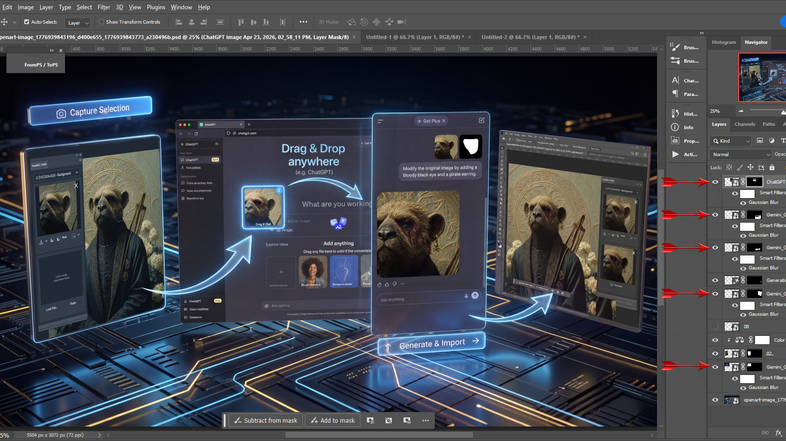
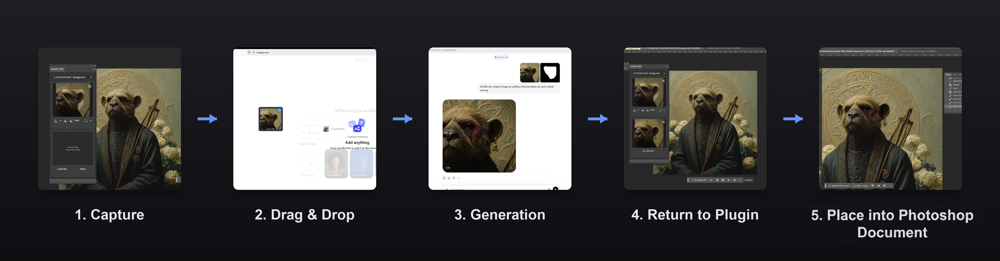
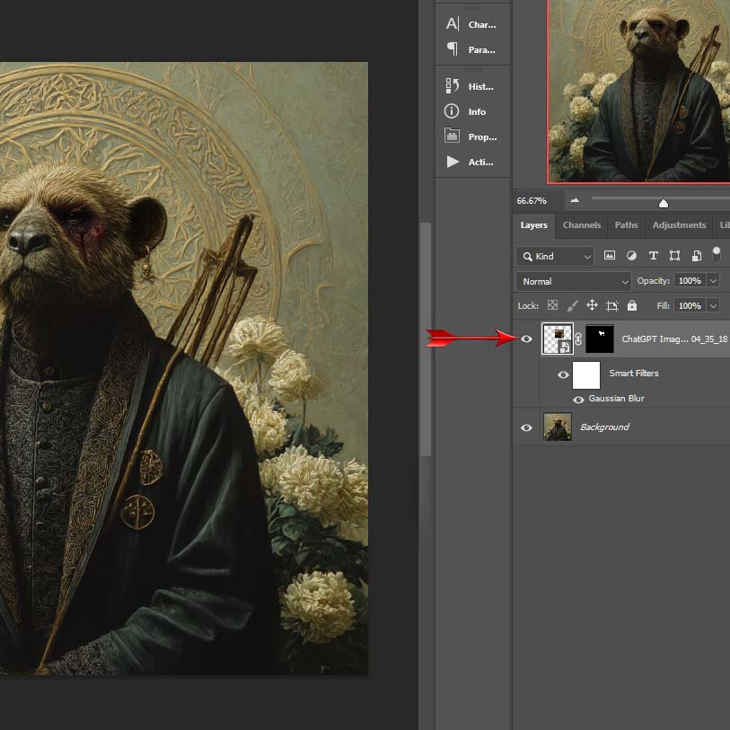
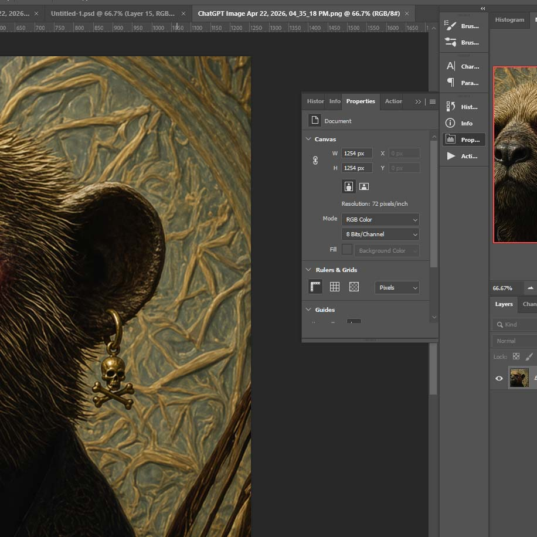
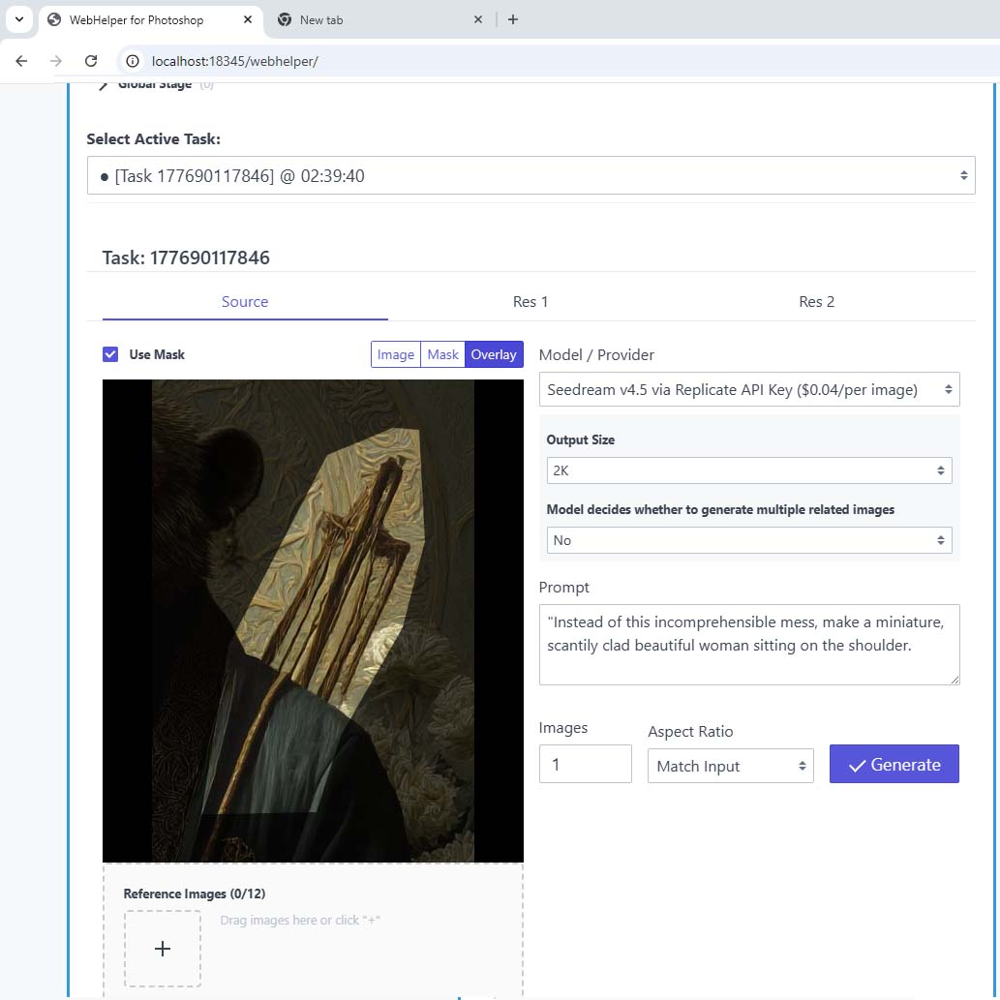
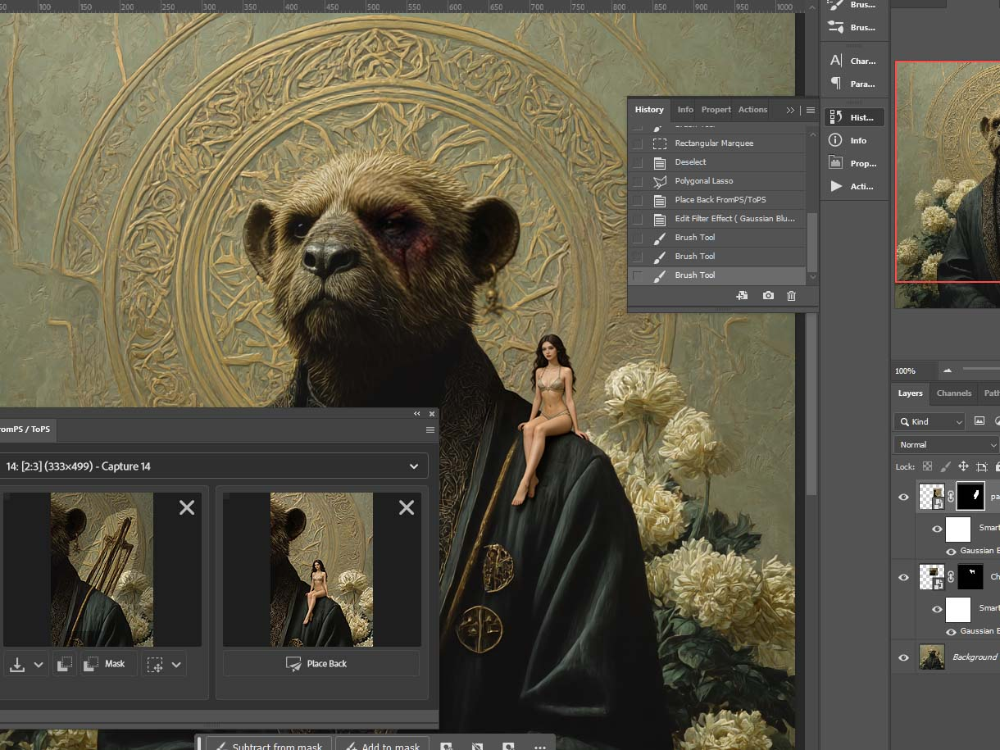
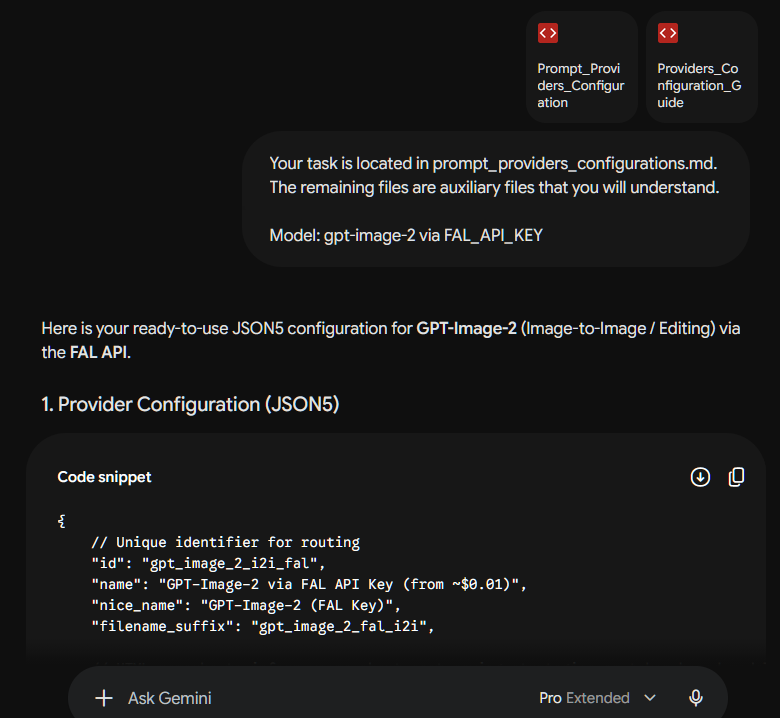
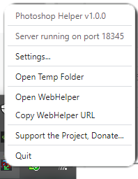

# ✨ FromPS / ToPS — Free Photoshop bridge for AI inpainting workflows

**Move Photoshop selections, masks, and AI-generated results between Photoshop and the image tools you already use.**

Photoshop's built-in AI is convenient, but many artists also use external tools. FromPS / ToPS is a workflow bridge. It turns browser-based tools, free tiers, or subscriptions (like Midjourney/Leonardo/ChatGPT), as well as high-end APIs, into a seamless Photoshop workflow, handling all the tedious manual work for you. Avoid paying for another per-generation wrapper and choose the provider/model that fits your project.

---

## Download

Release packages are available on the [GitHub Releases](../../releases) page:

- **Windows x64 installer** (`.exe`).
- **macOS DMG** (`.dmg`). *Note: This is currently an unsigned build.*

### 🪟 Windows Installation (SmartScreen)
Because this is an open-source project without a paid corporate certificate, Windows SmartScreen may show a blue "Windows protected your PC" warning. To install safely:
1. Click **More info** in the blue warning window.
2. Click the **Run anyway** button that appears.

### 🍏 macOS Installation (Unsigned Build)
Because the macOS build is currently unsigned, macOS Gatekeeper will block it by default with a "damaged app" or "unidentified developer" warning. To safely bypass this:

1. Always download the **.dmg** file (ignore the .zip file, it is used for internal updates).
2. Open the `.dmg` and drag the `PhotoshopHelper` app into your **Applications** folder.
3. To open it for the first time, **Right-click** (or Control-click) the app in your Applications folder and select **Open**. Click **Open anyway** in the security prompt.
4. *(Alternative for advanced users)* If macOS stubbornly blocks the app, open Terminal and run this command to clear the quarantine flag:
   `xattr -cr /Applications/PhotoshopHelper.app`

---

## 🤔 The Problem

You've found an incredible AI that generates exactly what you need — maybe it's a browser-based tool (free/paid tier of ChatGPT, Google Gemini, or a Midjourney subscription you're already paying for) or a specific API. But getting images **in and out** of Photoshop is pure pain:

1. ✂️ Select area → Screenshot → Crop manually → Save file
2. 🎭 Draw mask separately for inpaint
3. 🌐 Open browser → Upload image → Upload mask → Generate
4. 💾 Download result → Open in Photoshop → Resize → Position → Align → Mask edges...
5. 😤 Repeat 10 times per project

**FromPS / ToPS eliminates steps 1–5 entirely.** One click out, one click back — seamlessly.

---

## 🎬 Video Demo (40 Seconds)

https://github.com/user-attachments/assets/fe64b954-2257-489d-bef6-f94ab314ef13

---

## 🚀 How It Works

### Step 1: Select & Capture

Select any area in Photoshop with any tool. Click **Capture**. Done.

The plugin automatically extracts:
- 📸 The image content of your selection
- 🎭 A pixel-perfect mask matching the exact shape of your selection
- 📐 Smart aspect-ratio fitting (1:1, 2:3, 3:4, 9:16) for maximum AI compatibility

### Step 2: Send to AI or to any image editor

Choose your path:

| Method | How |
|--------|-----|
| 🌐 **Anywhere Drag & Drop (or Copy/Paste)** | Drag & Drop your image + mask directly into ChatGPT / Midjourney / Gemini in your browser, or into any other program. |
| ⚡ **API Generation** | Use the built-in WebHelper for direct API generations using your own API keys. |

### Step 3: Generate

Use the generated images and masks as a reference in your favorite AI tool. Drag and drop them directly into your browser, or use the built-in WebHelper for API-based generation.

### Step 4: Import Result

Got your results? Simply click **Paste** from clipboard or **Load File** in the ToPS panel to bring your generation into the plugin.

### Step 5: Place into Photoshop Document

Hit **Place Back** to finish the workflow. The plugin **automatically**:
- 🎯 Positions the result at the exact original coordinates
- 🔲 Wraps it in a Smart Object (non-destructive!)
- 🎭 Applies the original selection mask
- 🌫️ Adds Gaussian Blur to mask edges for seamless blending
- ↩️ Everything undoable with a single Ctrl+Z

<table>
  <tr>
    <td></td>
    <td></td>
  </tr>
</table>

---

## ⚡ Built-in WebHelper: Your Local API Workspace

While the browser-based workflow is great, **WebHelper** is designed for those who need to generate images using their own **API keys**. It gives you a single local command center (`localhost`) that connects Photoshop directly to professional-grade AI models.

If you prefer using your own credentials for privacy, higher limits, or specific models — WebHelper handles the technical bridge. Your images and masks arrive there **automatically** from Photoshop, letting you generate, compare, and send results back in one click.

<table>
  <tr>
    <td></td>
    <td></td>
  </tr>
</table>

### 🧩 Built-in API Providers (Infrastructures)
WebHelper is designed as a universal bridge. It includes modular **Response Handlers** that automatically manage the technical communication patterns of different AI architectures:

- **Universal Sync**: For direct APIs that return images immediately in the response (e.g., **xAI / Grok**).
- **FAL.ai Handler**: Optimized for FAL's asynchronous generation pipeline.
- **Replicate Handler**: Optimized for Replicate's asynchronous generation pipeline.
- **BFL.ai Handler**: Specialized polling engine for **Black Forest Labs (Flux models)** asynchronous generation pipeline.

> [!TIP]
> This architecture allows you to add many API services that match one of the supported response patterns by editing `providers.json` and linking the provider to a built-in handler. In this repository, see `PhotoshopHelper/Providers_Configuration_Guide.md` and `PhotoshopHelper/Prompt_Providers_Configuration.md`; installed builds may place a copy of the guide next to the helper configuration files.

---

### WebHelper Features:
- 🖼️ **Reference images**: Attach additional reference images to guide the AI
- 🎭 **Mask overlay**: See exactly what the AI will inpaint (toggle: image / mask / overlay)
- 🔄 **Multi-task**: Send multiple selections from Photoshop — each becomes an independent task
- 📊 **Parameter memory**: Settings are preserved when switching between AI providers
- 📋 **One-click copy**: Copy result straight to clipboard and paste into Photoshop
- 🔁 **Re-generate**: Not happy? Tweak the prompt and generate again — previous results stay
- ⛓️ **Iterative Chaining**: Launch a new task directly from any generated result to build complex generation chains
- 🌐 **Works standalone**: WebHelper can also be used independently, without Photoshop

---

## 🔒 Privacy and Security

PhotoshopHelper runs locally on your machine and is used for clipboard, drag-and-drop, and optional WebHelper API workflows.

Browser drag-and-drop workflows do not require API keys. API keys are only needed when you configure WebHelper providers yourself. 

To make the workflow work, the plugin/helper needs access to the local file system, clipboard, localhost communication, and network/API requests for the providers or browser tools you choose.

The plugin and Helper authenticate to each other with a token that PhotoshopHelper generates and delivers automatically — no setup step is required. See [SECURITY.md](SECURITY.md) for the full local access model.

Support reminders are based on a local usage counter; no usage data is sent for those reminders.

The helper is not intended to be exposed as a public server. Keep it on localhost unless you understand the risks.

---

## 📦 What's in the Package

| Component | What it does |
|-----------|-------------|
| **FromPS / ToPS Plugin** | The Photoshop panel — capture selections, place results back |
| **PhotoshopHelper** | Background companion app — enables clipboard, drag & drop, WebHelper, and local API access |

---

## 🛠️ Quick Start

1. **Install the Plugin** into Adobe Photoshop 2024+
2. **Launch PhotoshopHelper** (runs silently in the system tray)
3. **Open the panel**: Photoshop → Plugins → FromPS / ToPS
4. Start working! 🎉

> For WebHelper API generations, you only need the API key for the specific provider you choose to use — just drop it in a `.env` file. The free browser workflow requires no keys at all.

---

## 💎 Why FromPS / ToPS?

| Workflow need | Manual browser workflow | FromPS / ToPS |
|---|---|---|
| **Capture selection** | Screenshot/crop/export by hand | One-click source capture |
| **Mask** | Draw/export separately | Pixel-perfect mask from Photoshop selection |
| **Aspect ratio** | Manual canvas/crop decisions | Smart fitting presets |
| **Import result** | Open, resize, align manually | Place back at original coordinates |
| **Edit safety** | Depends on import method | Smart Object + Layer Mask |
| **Iteration speed** | Slow and repetitive | Built for repeated tries |

FromPS / ToPS is not another model-specific generator. It is a bridge for workflows where you want to choose the image tool yourself.

---

## 🎯 Perfect For

- 🎨 **Digital artists & illustrators** — quickly iterate on inpaint variations
- 📸 **Photo retouchers** — seamlessly remove/replace objects
- 🎮 **Concept artists** — generate environment or character variations
- 💼 **Freelancers** — speed up workflows while choosing the best AI models
- 🧪 **AI enthusiasts** — compare outputs from different models side by side

---

## ❓ FAQ

**1. Does it generate images by itself?**
No, it is a bridge. It sends your Photoshop selections to the AI tool of your choice (browser-based or API) and brings the results back.

**2. Do I need API keys?**
Only if you want to use the built-in WebHelper API feature. The browser drag-and-drop workflow requires no API keys.

**3. Does it send my images anywhere?**
If you use the browser drag-and-drop, the images go to whatever website you drop them into. If you use WebHelper, the images are sent directly from your local machine to the API provider you configured. There are no middleman servers.

**4. Is it free?**
Yes. The app is free to use and the core workflow is not locked behind a payment. If you use it heavily, it may occasionally show a dismissible support reminder. A supporter key simply snoozes those reminders for a long time.

**5. Is this open-source?**
No. FromPS / ToPS is source-available for transparency and for personal/non-commercial use, but it is distributed under a NonCommercial license (CC BY-NC-SA 4.0).

**6. Can I use the *generated images* for commercial client work?**
FromPS / ToPS does not claim rights over your outputs. Usage rights for generated or processed images depend on your rights to the input material and on the terms of the AI tool or API provider you used. The NonCommercial license restricts selling, monetizing, or commercially redistributing the *FromPS / ToPS software code itself*.

**7. Do I need to configure anything for the plugin to talk to PhotoshopHelper?**
No. PhotoshopHelper pairs itself with the plugin automatically on startup. If the panel ever reports that the Helper is "not paired," copy the token from the tray menu (Access Tokens) into the plugin's Settings dialog as a one-time fallback.

---

## 🖥️ System Requirements

- Adobe Photoshop 2024 (v24.0.0+)
- Windows 10/11
- macOS support is planned as an experimental unsigned build before a fully signed/notarized release
- Internet connection (for AI services)

---

## 📜 License

This project is source-available and free for personal and non-commercial use. It is licensed under the [Creative Commons Attribution-NonCommercial-ShareAlike 4.0 International License](http://creativecommons.org/licenses/by-nc-sa/4.0/). 

You are free to:
* **Share** — copy and redistribute the material in any medium or format
* **Adapt** — remix, transform, and build upon the material

Under the following terms:
* **Attribution (BY)** — You must give appropriate credit, provide a link to the license, and indicate if changes were made.
* **NonCommercial (NC)** — You may not use the material for commercial purposes (including selling the plugin, monetizing the code, or offering it as a paid service). 
* **ShareAlike (SA)** — If you remix, transform, or build upon the material, you must distribute your contributions under the same license as the original.

**Note on Commercial Usage of Output:** 
FromPS / ToPS does not claim rights over your outputs. The NonCommercial restriction applies to the *software code*, not to your image files. Usage rights for generated or processed images depend on your rights to the input material and on the terms of the AI tool or API provider you used.

---

## 🤝 Contributing & Feedback

Found a bug? Have an idea? Open an issue or pull request on GitHub!
